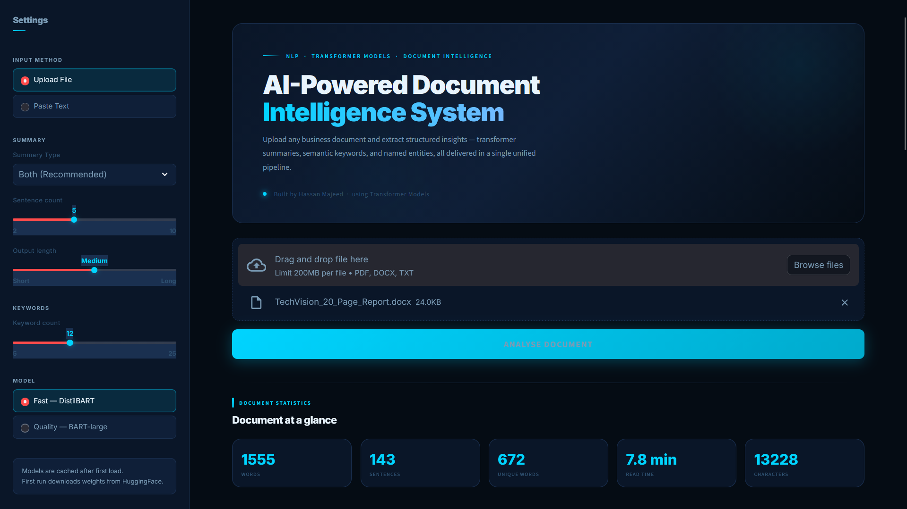
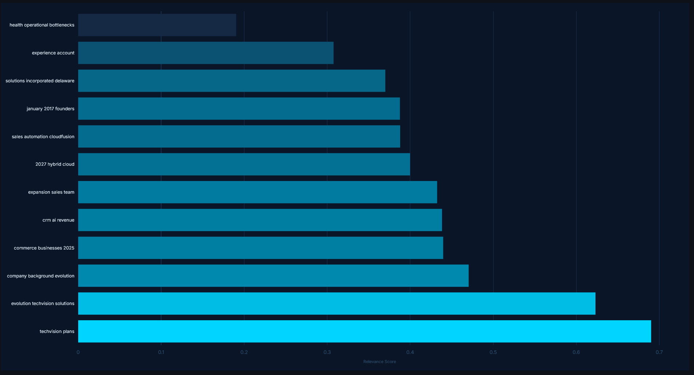
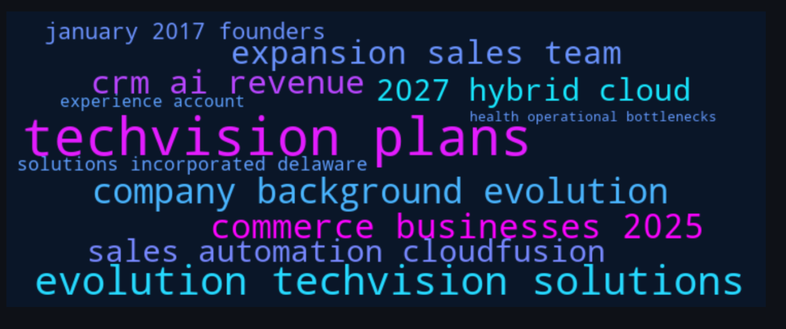

# AI-Powered Document Intelligence System using Transformer Models
## Hassan Majeed

## Abstract

Extracting structured insights from dense, unstructured business documents is a persistent challenge in enterprise AI. This project implements an **End-to-End Document Intelligence pipeline using a hybrid BART Transformer and BERT-based architecture**, capable of generating abstractive summaries, extracting semantically meaningful keyphrases, and identifying critical named entities from raw document input.

The system supports multiple document formats (PDF, DOCX, TXT) and delivers both an **Abstractive AI Summary** — where the model generates fluent new sentences in its own words — and an **Extractive Summary** that returns the most statistically important original sentences via TF-IDF scoring. A **Streamlit-based web application** provides a seamless user interface, allowing users to upload documents and instantly receive real-time AI-powered analysis.

---

## Demo

<p align="left">

</p>

---

## Introduction

Modern business operations generate enormous volumes of documents — financial reports, contracts, meeting minutes, and research briefs — that are time-consuming to manually parse. Traditional keyword search tools only find exact matches; they cannot **understand** the document's meaning or produce a coherent summary.

This project bridges that gap by utilizing **BART (facebook/bart-large-cnn)** to generate high-level abstractive summaries from document text, **KeyBERT with MiniLM embeddings** to extract semantically ranked keyphrases, and **SpaCy NER** to identify and categorize business-critical entities across the document. The system is built for robust, real-world document inference with GPU acceleration support.

---

## Problem Statement

To design and implement a document intelligence system that:
- Automatically ingests raw business documents in PDF, DOCX, and TXT formats with multi-encoding fallback chains.
- Generates fluent, human-readable abstractive summaries using a pre-trained BART transformer model.
- Extracts semantically meaningful keyphrases using BERT embeddings with Maximum Marginal Relevance for diversity.
- Identifies and categorizes named entities — organizations, people, financial figures, dates, and locations.
- Delivers all results through an interactive web interface with one-click report export.

---

## Objectives

- Build a robust multi-format document extraction pipeline using `pdfplumber`, `PyPDF2`, and `python-docx` with automatic fallback chains.
- Implement **Abstractive Summarization** using the pre-trained `facebook/bart-large-cnn` transformer model.
- Implement **Extractive Summarization** using TF-IDF vectorization to score and rank original sentences by statistical importance.
- Apply **KeyBERT** with `all-MiniLM-L6-v2` sentence embeddings for semantic keyphrase extraction.
- Apply **SpaCy** `en_core_web_sm` for Named Entity Recognition across 7 business-critical entity categories.
- Enable **CUDA GPU acceleration** with FP16 mixed precision for RTX-class hardware.
- Deploy the complete pipeline using a Streamlit web application.

---

## System Architecture

The system is divided into four primary layers:
1. **Input & Extraction Layer**
2. **Preprocessing Layer**
3. **NLP Inference Layer**
4. **Presentation & Export Layer**

### High-Level Architecture

```text
User Document Upload (.pdf / .docx / .txt)
              ↓
   Document Extraction Pipeline
   (pdfplumber → PyPDF2 fallback / python-docx / txt)
              ↓
     Text Cleaning & Preprocessing
     (Noise removal, encoding fix, sentence tokenization)
              ↓
   ┌──────────────────────────────────────┐
   │          NLP Inference Layer         │
   │                                      │
   │  BART Transformer                    │
   │  Abstractive Summarization           │
   │                                      │
   │  TF-IDF Sentence Scoring             │
   │  Extractive Summarization            │
   │                                      │
   │  KeyBERT + MiniLM Embeddings         │
   │  Semantic Keyword Extraction         │
   │                                      │
   │  SpaCy NER Pipeline                  │
   │  Entity Recognition (7 types)        │
   └──────────────────────────────────────┘
              ↓
   Streamlit Web Interface
   (Metric Cards · Summaries · Charts · Entity Pills)
              ↓
   Export: Markdown / Word (.doc) / Plain Text
```

---

## Data Flow Diagram (DFD)

### DFD Level 1 (Detailed Data Flow)

```text
+---------+
|  User   |
+---------+
     |
     | Uploads Document (PDF / DOCX / TXT)
     v
+-------------------------------+
| Document Extraction           |
| - pdfplumber  (primary)       |
| - PyPDF2      (fallback)      |
| - python-docx (Word files)    |
| - Multi-encoding TXT reader   |
+-------------------------------+
     |
     | Raw Text String
     v
+-------------------------------+
| Text Preprocessing            |
| - Whitespace normalization    |
| - Unicode encoding fixes      |
| - Sentence tokenization       |
| - Document statistics         |
+-------------------------------+
     |
     | Clean Text + Sentence List
     v
+-------------------------------+
| Tokenizer-Safe Chunker        |
| - Encode via AutoTokenizer    |
| - Slice by real token count   |
| - Max 900 tokens per chunk    |
| - Prevents BART IndexError    |
+-------------------------------+
     |
     | Safe Text Chunks
     v
+-------------------------------+
| BART Transformer (GPU fp16)   |
| - Chunk 1 → Summary 1         |
| - Chunk N → Summary N         |
| - Merge → Final Summary       |
+-------------------------------+
     |
     +-------------------------------+
     | TF-IDF Vectorizer             |
     | - Score all sentences         |
     | - Return top-N sentences      |
     +-------------------------------+
     |
     +-------------------------------+
     | KeyBERT + MiniLM              |
     | - MMR diversity algorithm     |
     | - Ranked keyphrases + scores  |
     +-------------------------------+
     |
     +-------------------------------+
     | SpaCy NER Pipeline            |
     | - ORG, PERSON, MONEY          |
     | - DATE, GPE, PERCENT, PRODUCT |
     +-------------------------------+
     |
     | Structured Results
     v
+-------------------------------+
| Streamlit Presentation Layer  |
| - Document metric cards       |
| - Tabbed summary display      |
| - Plotly keyword bar chart    |
| - Keyword word cloud          |
| - Color-coded entity pills    |
| - Export buttons (3 formats)  |
+-------------------------------+
     |
     | Analysis Report
     v
+---------+
|  User   |
+---------+
```

---

## Technology Stack

| Component | Technology |
|--------|-----------|
| Programming Language | Python 3.10+ |
| Deep Learning Framework | HuggingFace Transformers 4.40 / PyTorch 2.2 |
| Abstractive Summarization | facebook/bart-large-cnn |
| Extractive Summarization | scikit-learn TF-IDF Vectorizer |
| Keyword Extraction | KeyBERT 0.8 + all-MiniLM-L6-v2 |
| Named Entity Recognition | SpaCy 3.7 (en_core_web_sm) |
| Document Parsing | pdfplumber 0.10, PyPDF2 3.0, python-docx 1.1 |
| Web Framework | Streamlit 1.33 |
| Data Visualization | Plotly 5.20, Matplotlib 3.8, WordCloud 1.9 |
| GPU Acceleration | CUDA FP16 (auto-detected) |

---

## NLP Output Visualizations

The system was evaluated on real business documents, producing accurate keyword extraction and entity detection results.

**1. Keyword Relevance Chart**
BERT-powered semantic relevance scores for extracted keyphrases, ranked by importance using Maximum Marginal Relevance.

<p align="left">

</p>

**2. Keyword Word Cloud**
Visual frequency map of the most semantically important topics extracted from the document.

<p align="left">

</p>

---

## Training Strategies

- **Tokenizer-Safe Chunking:** Used the model's own `AutoTokenizer` to encode text by real token count, preventing the BART positional embedding `IndexError` on long documents.
- **GPU FP16 Mixed Precision:** Enabled `torch.float16` on CUDA devices to halve VRAM usage and deliver ~30–40% faster inference on RTX-class hardware.
- **Cached Model Loading:** All NLP models are loaded once via `@st.cache_resource` and reused across requests, eliminating repeated download overhead.
- **MMR Diversity in KeyBERT:** Maximum Marginal Relevance algorithm ensures extracted keyphrases are semantically diverse and non-redundant.

---

## Limitations & Future Enhancements

### Limitations

- Documents must be text-based; scanned image-only PDFs without an OCR layer return minimal text.
- Fixed transformer context window of 900 tokens per chunk — very long documents processed sequentially may lose cross-chunk context.
- The small SpaCy model has lower precision on specialized domains such as legal or medical text.

### Future Enhancements

- Integration of OCR (`pytesseract` or `easyocr`) to handle scanned PDFs and image-based documents.
- Upgrade to `en_core_web_trf` (SpaCy transformer model) for higher entity recognition accuracy.
- Replace BART with a locally hosted LLaMA 3 or Mistral model via Ollama for full offline operation.
- Cloud-based deployment (AWS / HuggingFace Spaces) using Docker containers.
- Multilingual support using mBART or mT5 for non-English business documents.

---

## Conclusion

This project successfully bridges transformer-based language modeling and classical NLP techniques, demonstrating how raw, unstructured business documents can be processed into actionable structured intelligence. The integration of the complete pipeline into a web interface highlights the practical, end-to-end capabilities required in modern AI engineering.

---

## How to Run the Project

```bash
# 1. Clone the repository
git clone https://github.com/hassanmajeed/business-doc-summarizer.git
cd business-doc-summarizer

# 2. Create and activate virtual environment
python -m venv venv
venv\Scripts\activate

# 3. Install dependencies
pip install -r requirements.txt

# 4. GPU users — RTX 3060 or any CUDA device
pip install torch torchvision torchaudio --index-url https://download.pytorch.org/whl/cu121

# 5. Download SpaCy language model
python -m spacy download en_core_web_sm

# 6. Run the Streamlit Application
streamlit run app/streamlit_app.py
```

---

## ⚠️ Important Note on Model Weights

This project uses pre-trained models from the **HuggingFace Hub** that are downloaded automatically on first run. No separate weight files need to be managed manually.

| Model | Size | Purpose |
|--------|-----------|--------|
| sshleifer/distilbart-cnn-12-6 | ~300 MB | Fast abstractive summarization |
| facebook/bart-large-cnn | ~1.6 GB | High-quality abstractive summarization |
| all-MiniLM-L6-v2 | ~90 MB | KeyBERT sentence embeddings |
| en_core_web_sm | ~12 MB | SpaCy Named Entity Recognition |

Models are cached after first download at `C:\Users\<you>\.cache\huggingface\` (Windows) or `~/.cache/huggingface/` (Linux/Mac).